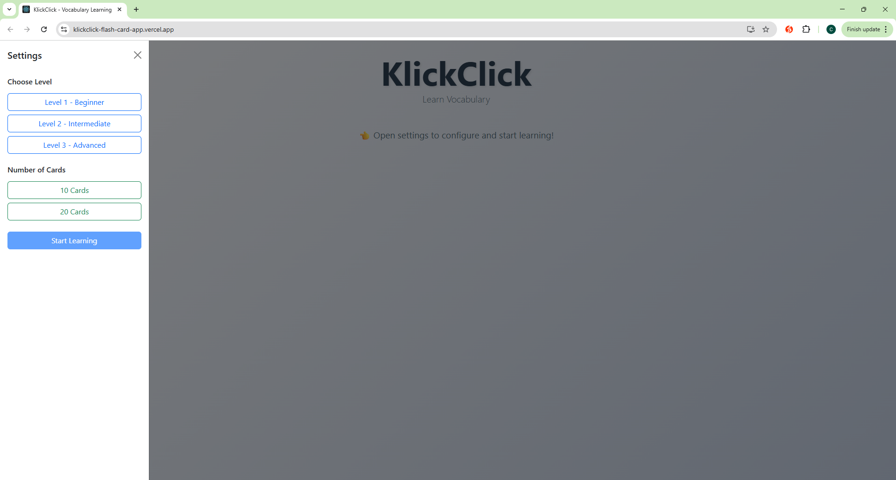
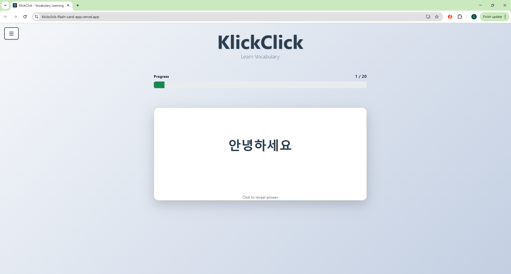

# KlickClick

A vocabulary learning flashcard application built with React for improving Korean pronunciation and vocabulary through daily practice.





## Why I Built This

**The Problem:**
After taking Korean beginner classes, I realized I wasn't good at reading Korean words quickly with the correct pronunciation. I tried several flashcard web apps but faced several limitations:

- Most apps required uploading files or creating custom decks
- Random words were tested instead of commonly used daily vocabulary
- Difficult to verify if I was reading the Hangul correctly before seeing the answer
- Lacked focus on pronunciation practice

**The Inspiration:**
Watching my nephew in kindergarten learn words using physical flashcards inspired me to create a digital version that focuses on the fundamentals - reading, pronunciation, and meaning.

**The Solution:**
Built KlickClick with the following improvements:

- **Two-Click Verification:** First click shows pronunciation in romanization to verify you read the Hangul correctly, second click moves to next card
- **Pre-loaded Vocabulary:** Curated Korean words organized by difficulty (Beginner, Intermediate, Advanced) with commonly used daily vocabulary
- **No Setup Required:** Start learning immediately without uploading files or creating decks
- **Pronunciation Focus:** Includes both Hangul and romanized pronunciation to help improve reading accuracy
- **Flexible Practice:** Choose between 10 or 20 cards per session for daily practice

## Features

- Three difficulty levels: Beginner, Intermediate, Advanced
- Choose 10 or 20 cards per study session
- Two-click interaction:
  - First click: Reveals romanized pronunciation and English meaning
  - Second click: Moves to next card
- Progress tracking with visual progress bar
- Collapsible sidebar menu for settings
- Pre-loaded with 60 Korean vocabulary words (20 per level)
- Clean, distraction-free interface
- Responsive design

## Technologies

**Frontend**
- React 19
- Bootstrap 5
- Font Awesome
- CSS3

## Installation

```bash
# Clone the repository
git clone <repository-url>
cd flash-card-app

# Install dependencies
npm install

# Start the application
npm start
```

The app will open in your browser at [http://localhost:3000](http://localhost:3000)

## How to Use

1. **Open the Menu**
   - Click the "☰ Menu" button in the top-left corner to open the settings sidebar

2. **Select Difficulty Level**
   - Choose from three levels:
     - **Beginner**: Basic, commonly used vocabulary
     - **Intermediate**: Everyday conversational words
     - **Advanced**: More complex vocabulary

3. **Choose Number of Cards**
   - Select either 10 or 20 cards for your study session
   - Start with 10 cards if you're a beginner or have limited time

4. **Start Learning**
   - Click the "Start Learning" button to begin your flashcard session
   - A progress bar will show how many cards you've completed

5. **Study with Two-Click Method**
   - **First Click**: Read the Korean word (Hangul) on the card and try to pronounce it
     - After clicking, the romanized pronunciation and English meaning will appear
     - Check if you read it correctly
   - **Second Click**: Once you've reviewed the pronunciation and meaning, click again to move to the next card

6. **Complete Your Session**
   - Continue through all cards in your session
   - When finished, you'll see a completion message
   - Click "Back to Menu" to start a new session
